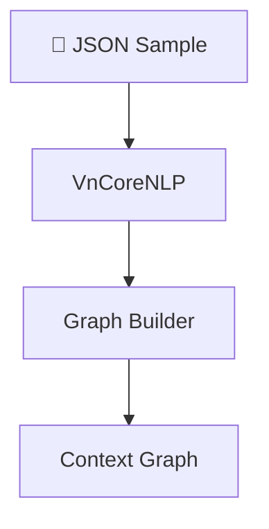
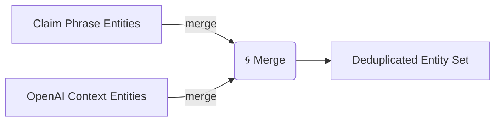
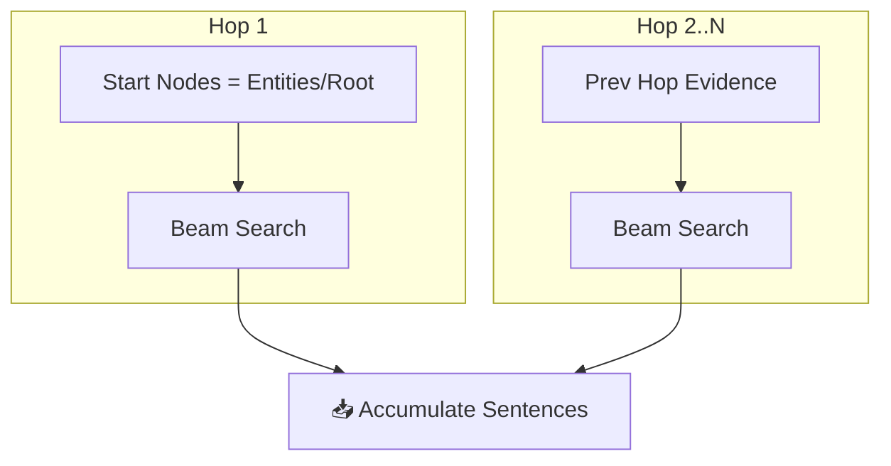
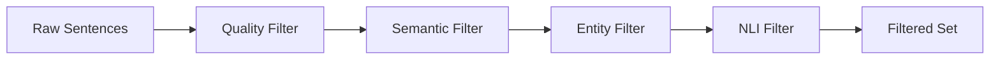
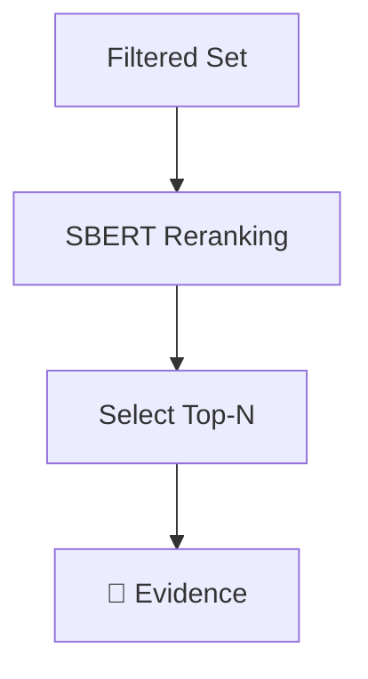
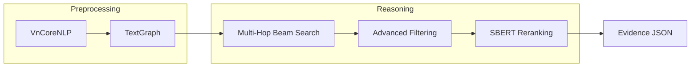

# 📑 Luồng Xử Lý Dữ Liệu: Từ *Context* Đến *Evidence*

> **Mục tiêu**: Giải thích chi tiết từng bước hệ thống chuyển đổi *context* thô sang tập câu *evidence* đã được xếp hạng, sử dụng **Multi-Hop Multi-Beam Search** và **Advanced Filtering**.

---

## 1️⃣ Nhập Liệu & Tiền Xử Lý

| Bước | Thành phần | Mô tả |
|------|------------|-------|
| 1.1 | **Input JSON** | `{ "context", "claim", "evidence", "label" }` |
| 1.2 | **Sentence Segmentation** | `VnCoreNLP` tách câu trong *context* & *claim*. |
| 1.3 | **POS / NER / Parsing** | VnCoreNLP gán `POS`, `NER`, `dep` cho từng token. |
| 1.4 | **Graph Construction** | Tạo `TextGraph` gồm **word nodes**, **sentence nodes**, **dependency edges**, **semantic edges**. |

**🔎 Chi tiết thực thi**
- **1.1** Đọc file JSON ➜ kiểm tra schema, loại bỏ bản ghi thiếu trường.
- **1.2** Gọi `model.annotate_text()` để cắt câu (tiết kiệm thời gian bằng batch).
- **1.3** Dùng cùng `VnCoreNLP` output lấy `posTag`, `nerLabel`, `depParent`.
- **1.4** Khởi tạo `TextGraph.build_from_vncorenlp_output()`:
  - Thêm *word nodes* + *sentence nodes*.
  - Tạo *dependency edges* giữa từ phụ thuộc & gốc.
  - Tính *SBERT* & *PhoBERT* similarity giữa câu ➜ *semantic edges*.



---

## 2️⃣ Trích Xuất Thực Thể (Entity Extraction)

| Nguồn | Kỹ thuật | Đầu ra |
|-------|----------|--------|
| **Phrase-Based** | Pattern + POS trên *claim* | Cụm danh từ, tên riêng |
| **OpenAI GPT-4o** | Prompt + Few-shot | Thực thể ngữ cảnh |

**🔎 Chi tiết thực thi**
- **2.1 Phrase-Based**
  - Lọc chuỗi danh từ (`Np`, `N`) liền kề trong *claim*.
  - Loại bỏ stopword & token ≤2 ký tự.
- **2.2 OpenAI**
  - Ghép *context* rút gọn + *claim* ➜ prompt "Liệt kê entity".
  - Parse JSON response, chuẩn hoá chữ thường.
- **2.3 Merge & Dedup**
  - Gộp hai danh sách, dùng `set(lower_strip)` loại trùng.
  - Kết quả ➜ `entities[]` + thêm node `entity_` vào graph.



---

## 3️⃣ Multi-Hop Multi-Beam Search

| Tham số chính | Giá trị mặc định |
|---------------|------------------|
| `max_levels` | **4** |
| `beam_width_per_level` | **10** |
| `max_depth` | **50** |
| `num_hops` | **3** |

**🔎 Chi tiết thực thi**
- **HOP 1**
  1. Chọn *start nodes* = toàn bộ `entities[]` hoặc `root`.
  2. Gọi `multi_level_beam_search_paths()` với `max_levels=4`.
  3. Ở mỗi level, tính SBERT sim, giữ *Top-K* = `beam_width_per_level`.
  4. Gom tất cả path ➜ `raw_sentences_hop1` (loại path ≤5 ký tự).
- **HOP 2..N**
  1. Lặp qua từng câu evidence hop trước.
  2. Beam-search cá nhân bắt đầu từ node câu đó.
  3. Áp dụng Level-filtering SBERT tương tự.
  4. Thêm vào `all_accumulated_sentences` nếu chưa xuất hiện.



---

## 4️⃣ Bộ Lọc Nâng Cao (Advanced Filtering)

Pipeline gồm **4 tầng**:
1. **Quality Check** – độ dài, cấu trúc, định dạng ➜ `quality_score`.
2. **Semantic Relevance** – SBERT/PhoBERT similarity ➜ `relevance_score`.
3. **Entity Overlap** – giao cắt thực thể với *claim* ➜ `entity_score`.
4. **NLI Stance** (tuỳ chọn) – XLM-R xác định `support` / `refute`.

**🔎 Chi tiết thực thi**
- **Quality**: loại câu <10 từ, nhiều ký tự đặc biệt, hoặc thiếu động từ.
- **Semantic**: `cosine_similarity` ≥ threshold; fallback giữ top-k nếu quá ít.
- **Entity**: Tính tỉ trọng token trùng entity/claim, yêu cầu ≥ 0.05.
- **NLI**: Nếu bật, dùng `xnli` tính `support-prob` – `refute-prob` ≥ `stance_delta`.



---

## 5️⃣ SBERT Reranking & Tổng Hợp

**🔎 Chi tiết thực thi**
- Encode toàn bộ câu & *claim* ➜ embedding 768-D.
- Tính `cosine_similarity` ➜ `final_sbert_score`.
- Sắp xếp giảm dần, lấy `max_final_sentences` (mặc định 25).
- Ghi nguồn hop, score & metadata vào JSON output.



---

## 6️⃣ Định Dạng Kết Quả

```jsonc
{
  "multi_level_evidence": [
    {
      "sentence": "Donald Trump sinh ngày 14 tháng 6 năm 1946...",
      "score": 0.87,
      "quality_score": 0.92,
      "relevance_score": 0.81,
      "final_sbert_score": 0.93,
      "source": "beam_search",
      "multi_hop_metadata": { "source_hop": 1 }
    }
  ],
  "statistics": {
    "coverage_percentage": 18.5,
    "hop_breakdown": {
      "hop_1": { "raw": 120, "filtered": 32 },
      "hop_2": { "raw": 58, "filtered": 12 }
    }
  }
}
```

---

## 7️⃣ Tuỳ Biến Nhanh

| Mục tiêu | Tham số CLI |
|----------|-------------|
| Tăng coverage | `--beam_width_per_level 15` |
| Giảm thời gian chạy | `--max_depth 20` |
| Nhấn mạnh thực thể | `--use_entity_filtering` |
| Kiểm tra stance | `--use_contradiction_detection` |

---

## 8️⃣ Lược Đồ Phụ Thuộc Thành Phần



---

### 🤝 Đóng Góp
Đóng góp ý tưởng hoặc pull request đều được chào đón! Vui lòng tạo issue trước khi PR.

### 📜 Giấy Phép
Mã nguồn phát hành theo giấy phép **MIT**. 