# 🔬 Vietnamese Multi-Hop Fact-Checking: Detailed Workflow

## 📋 **Tổng quan Pipeline**

Hệ thống xử lý fact-checking qua **8 phases chính** với **32+ sub-steps** sử dụng **2-tier filtering approach**:

```mermaid
graph TD
    A[🔄 INPUT: Claim + Context] --> B[🏗️ Graph Construction]
    B --> C[🎯 Entity Extraction]
    C --> D[🚀 Multi-Hop Beam Search + Level Filtering]
    D --> E[🔍 Advanced Filtering]
    E --> F[🧠 SBERT Reranking]
    F --> G[📊 Result Aggregation]
    G --> H[✅ OUTPUT: Ranked Evidence]
    
    D --> D1[Level 0: SBERT Filter → Top 5]
    D --> D2[Level 1: SBERT Filter → Top 5]
    D --> D3[Level 2: SBERT Filter → Top 5]
```



---

## 🏗️ **Phase 1: Graph Construction & Preprocessing**

### 1.1 VnCoreNLP Analysis
```python
# Input: Raw Vietnamese text
claim = "Cựu tổng thống Mỹ Donald Trump sinh năm 1946."
context = ["Donald Trump sinh ngày 14 tháng 6 năm 1946...", "..."]

# VnCoreNLP Processing
vncorenlp_output = {
    'sentences': {
        0: [{'wordForm': 'Donald', 'posTag': 'Np'}, ...],
        1: [{'wordForm': 'Trump', 'posTag': 'Np'}, ...]
    }
}
```

### 1.2 Knowledge Graph Construction
```python
# Word nodes: 2,500-3,500 nodes
# Sentence nodes: 100-500 nodes  
# Dependency edges: 8,000-15,000 edges
# Semantic similarity edges: 12,000-25,000 edges

graph_stats = {
    'nodes': 3847,
    'edges': 18234,
    'word_nodes': 2891,
    'sentence_nodes': 152,
    'dependency_edges': 12456,
    'semantic_edges': 5778
}
```

### 1.3 Semantic Edge Construction
- **SBERT embeddings** cho sentence similarity (threshold: 0.7)
- **PhoBERT embeddings** cho word similarity (threshold: 0.8)
- **Dependency edges** từ VnCoreNLP parsing

---

## 🎯 **Phase 2: Enhanced Entity Extraction**

### 2.1 Phrase-based Entity Extraction
```python
# Từ claim sử dụng VnCoreNLP
phrase_entities = [
    "Donald Trump",      # Proper noun sequence
    "cựu tổng thống",   # Noun phrase
    "năm 1946"          # Time expression
]
```

### 2.2 OpenAI GPT-4o-mini Entity Extraction
```python
# Enhanced prompt for Vietnamese entities
openai_entities = [
    "Donald Trump",
    "Tổng thống Mỹ", 
    "1946",
    "ngày 14 tháng 6"
]
```

### 2.3 **Equal Entity Scoring** (Updated)
```python
# ALL entities now get equal treatment
entity_scores = {
    'donald trump': {'score': 1.0, 'sources': {'phrase', 'openai'}},
    'tổng thống mỹ': {'score': 1.0, 'sources': {'phrase'}},
    '1946': {'score': 1.0, 'sources': {'openai'}}
}
# ✅ No more dual-source boosting - all entities equal priority
```

---

## 🚀 **Phase 3: 2-Tier Multi-Hop Beam Search** (NEW PIPELINE)

### 3.1 **HOP 1: Beam Search với Level-wise SBERT Filtering**
```python
# STAGE 1: Multi-level beam search với SBERT filtering mỗi level
beam_results_hop1 = text_graph.multi_level_beam_search_paths(
    max_levels=3,
    beam_width_per_level=6,
    max_depth=30,
    sbert_model=sbert_model,    # ✅ Pass SBERT model for level filtering
    claim_text=claim,
    filter_top_k=5,             # ✅ Keep top 5 sentences per level
    use_phobert=False           # ✅ Use SBERT by default
)

# Level-wise filtering process:
# Level 0: Raw beam search → SBERT similarity ≥ 0.4 → Top 5 sentences
# Level 1: Raw beam search → SBERT similarity ≥ 0.4 → Top 5 sentences  
# Level 2: Raw beam search → SBERT similarity ≥ 0.4 → Top 5 sentences
print(f"📦 Beam search with level filtering: {total_collected} sentences")
```

### 3.2 **Level-wise SBERT Filtering Logic**
```python
# For each level in beam search
if sbert_model and claim_text and unique_new:
    # Calculate SBERT similarities
    claim_embedding = sbert_model.encode([claim_text])
    sentence_embeddings = sbert_model.encode(sentence_texts)
    similarities = cosine_similarity(claim_embedding, sentence_embeddings)[0]
    
    # Filter by similarity threshold (0.4 for level filtering)
    similarity_threshold = 0.4
    filtered_nodes = []
    for node, similarity in zip(unique_new, similarities):
        if similarity >= similarity_threshold:
            filtered_nodes.append(node)
    
    # Keep at least filter_top_k=5 sentences even if below threshold
    if len(filtered_nodes) < 5 and unique_new:
        # Sort by similarity and take top 5
        node_sim_pairs = list(zip(unique_new, similarities))
        node_sim_pairs.sort(key=lambda x: x[1], reverse=True)
        filtered_nodes = [node for node, _ in node_sim_pairs[:5]]
    
    unique_new = filtered_nodes
    print(f"🔍 SBERT level filtering: {len(unique_new)} sentences retained")
```

### 3.3 **HOP 1: Advanced Filtering AFTER Beam Search**
```python
# STAGE 2: Apply comprehensive advanced filtering to beam search results
if use_advanced_filtering:
    # Relaxed thresholds for hop 1
    filtered_sentences_hop1 = advanced_filter.multi_stage_filtering_pipeline(
        sentences=beam_search_results,  # Already level-filtered
        claim_text=claim,
        min_quality_score=0.1,    # Lowered from 0.3
        min_relevance_score=0.1,  # Lowered from 0.25
        max_final_sentences=30
    )['filtered_sentences']
    print(f"🔍 Hop 1 Advanced Filter: {len(filtered_sentences_hop1)} final sentences")
```

### 3.4 **HOP 1: SBERT Reranking AFTER Filtering**
```python
# STAGE 3: Final SBERT reranking on filtered results
if use_sbert:
    reranked_sentences_hop1 = sbert_reranker.rerank_sentences(
        sentences=filtered_sentences_hop1,
        claim_text=claim,
        use_phobert=False  # Use SBERT for consistency
    )
    print(f"🧠 Hop 1: SBERT reranking complete")
```

### 3.5 **HOP 2+: Individual Node Processing với Level Filtering**
```python
# For each sentence from previous hop
for sentence in hop1_results:
    # STAGE 1: Beam search với level filtering từ sentence này
    individual_beam_results = text_graph.multi_level_beam_search_paths(
        start_from_sentence=sentence,
        max_levels=3,
        beam_width_per_level=6,
        max_depth=30,
        sbert_model=sbert_model,    # ✅ Level filtering enabled
        claim_text=claim,
        filter_top_k=5              # ✅ Top 5 per level
    )
    
    # Level filtering đã được apply trong beam search
    raw_sentences_from_node = extract_sentences_from_paths(individual_beam_results)
    all_hop2_sentences.extend(raw_sentences_from_node)

# STAGE 2: Advanced filtering cho ALL hop 2 results
filtered_sentences_hop2 = advanced_filter.multi_stage_filtering_pipeline(
    sentences=all_hop2_sentences,    # Pre-filtered by level filtering
    claim_text=claim,
    min_quality_score=0.3,  # Standard thresholds for hop 2+
    min_relevance_score=0.25,
    max_final_sentences=4   # Limit hop 2+ to 4 sentences
)['filtered_sentences']

# STAGE 3: SBERT reranking
reranked_sentences_hop2 = sbert_reranker.rerank_sentences(
    sentences=filtered_sentences_hop2,
    claim_text=claim
)
```

---

## 🔍 **Phase 4: Advanced Multi-Stage Filtering** (Post Beam Search)

### 4.1 Quality-Based Filtering
```python
def stage1_quality_filtering(sentences, min_quality_score=0.3):
    # Text quality metrics
    quality_scores = []
    for sent in sentences:
        score = calculate_quality_score(sent)
        # Factors: length, grammar, informativeness
        quality_scores.append(score)
    
    return [s for s, score in zip(sentences, quality_scores) 
            if score >= min_quality_score]
```

### 4.2 Semantic Relevance Filtering
```python
def stage2_semantic_relevance_filtering(sentences, claim, min_relevance=0.25):
    # SBERT similarity với claim (second time - more strict)
    similarities = sbert_model.similarity(
        [claim] * len(sentences),
        [s['sentence'] for s in sentences]
    )
    
    return [s for s, sim in zip(sentences, similarities) 
            if sim >= min_relevance]
```

### 4.3 Entity-Based Filtering
```python
def stage3_entity_filtering(sentences, entities, min_entity_score=0.05):
    # Count entity overlaps
    entity_scores = []
    for sent in sentences:
        overlap_count = count_entity_overlaps(sent['sentence'], entities)
        entity_scores.append(overlap_count / len(entities))
    
    return [s for s, score in zip(sentences, entity_scores) 
            if score >= min_entity_score]
```

### 4.4 Contradiction Detection (Optional)
```python
def stage4_contradiction_detection(sentences, claim, delta=0.1):
    # NLI model for contradiction detection
    nli_results = nli_model.predict_batch(
        [(claim, s['sentence']) for s in sentences]
    )
    
    # Filter out contradictory sentences
    return [s for s, nli in zip(sentences, nli_results) 
            if nli['label'] != 'CONTRADICTION']
```

---

## 🧠 **Phase 5: SBERT Reranking** (Final)

### 5.1 **SBERT-Only Final Reranking**
```python
def final_sbert_reranking(sentences, claim_text):
    # ✅ SBERT for consistency across pipeline
    claim_embedding = sbert_model.encode([claim_text])
    sentence_embeddings = sbert_model.encode([s['sentence'] for s in sentences])
    
    # Cosine similarity
    similarities = cosine_similarity(claim_embedding, sentence_embeddings)[0]
    
    # Update scores
    for i, sent in enumerate(sentences):
        sent['sbert_similarity'] = similarities[i]
        sent['final_score'] = sent.get('score', 0) + similarities[i]
    
    # Sort by final score
    return sorted(sentences, key=lambda x: x['final_score'], reverse=True)
```

---

## 📊 **Phase 6: Multi-Path Aggregation** (Updated)

### 6.1 **Equal Treatment for Multi-Path Sentences**
```python
def aggregate_multi_path_sentences(sentence_score_map):
    for sent_text, data in sentence_score_map.items():
        scores = data['scores']
        paths_count = data['paths_count']
        
        # ✅ No bonus for multiple paths - equal treatment
        final_score = sum(scores) / len(scores)  # Just average
        paths_bonus = 0.0  # No bonus
        
        data['sentence_data']['final_score'] = final_score
        data['sentence_data']['paths_bonus'] = paths_bonus
        data['sentence_data']['paths_count'] = paths_count
```

---

## 🎯 **Phase 7: Final Result Compilation**

### 7.1 Cross-Hop Deduplication
```python
def deduplicate_across_hops(hop_results):
    seen_texts = set()
    unique_sentences = []
    
    # Normalize text for comparison
    def normalize_text(text):
        return ' '.join(text.strip().lower().split())
    
    for hop_result in hop_results:
        for sent in hop_result['filtered_sentences']:
            normalized = normalize_text(sent['sentence'])
            if normalized not in seen_texts:
                seen_texts.add(normalized)
                unique_sentences.append(sent)
    
    return unique_sentences
```

### 7.2 **Final Cross-Hop SBERT Reranking**
```python
# Apply final SBERT reranking across all hops
final_sentences = sbert_reranker.rerank_sentences(
    sentences=unique_sentences,
    claim_text=claim,
    use_phobert=False  # ✅ Use SBERT for final step
)
```

### 7.3 **Original Order Sorting (Default)**
```python
def sort_by_original_order(sentences):
    # Extract sentence index from sentence_id (e.g., 'sentence_5' -> 5)
    def extract_index(sentence_id):
        try:
            if sentence_id.startswith('sentence_'):
                return int(sentence_id.replace('sentence_', ''))
            return 999999  # Unknown format at end
        except:
            return 999999
    
    # Sort by original context order
    return sorted(sentences, key=lambda x: extract_index(x['sentence_id']))
```

---

## 📈 **Phase 8: Performance Statistics**

### 8.1 Hop-by-Hop Statistics
```python
comprehensive_stats = {
    'total_hops': 3,
    'hop_details': [
        {
            'hop_number': 1,
            'beam_search_raw': 120,         # More raw sentences
            'level_filtered': 45,           # After level SBERT filtering
            'after_advanced_filter': 23,    # After 4-stage filtering
            'after_final_reranking': 20,    # After SBERT reranking
            'level_filtering_rate': 62.5%,  # Level filtering effectiveness
            'advanced_filtering_rate': 48.9% # Advanced filtering effectiveness
        },
        {
            'hop_number': 2,
            'beam_search_raw': 80,
            'level_filtered': 30,
            'after_advanced_filter': 8,
            'after_final_reranking': 4,
            'level_filtering_rate': 62.5%,
            'advanced_filtering_rate': 73.3%
        }
    ],
    'final_evidence_count': 24,
    'total_processing_time': '3.12s'
}
```

### 8.2 Quality Metrics
```python
quality_metrics = {
    'average_level_similarity': 0.52,   # Average SBERT similarity in level filtering
    'average_final_relevance': 0.67,    # Final relevance after all filtering
    'average_entity_coverage': 0.72,
    'multi_path_sentences': 8,
    'unique_sentences': 24,
    'coverage_rate': 0.86,
    'level_filtering_efficiency': 0.625  # Level filtering reduces noise by ~62%
}
```

---

## 🔧 **Key Configuration Parameters**

```python
PIPELINE_CONFIG = {
    # Beam Search + Level Filtering
    'max_levels': 3,
    'beam_width_per_level': 6,
    'max_depth': 30,
    'filter_top_k': 5,              # ✅ Top 5 sentences per level
    'level_similarity_threshold': 0.4,  # ✅ SBERT threshold for level filtering
    
    # Advanced Filtering (Applied After Beam Search)
    'min_quality_score': 0.3,
    'min_relevance_score': 0.25,
    'min_entity_score': 0.05,
    'stance_delta': 0.1,
    
    # Entity Scoring (Equal Treatment)
    'dual_source_boost': 1.0,      # ✅ No boost
    'phrase_entity_score': 1.0,
    'openai_entity_score': 1.0,
    
    # Multi-Path Aggregation (Equal Treatment)
    'multi_path_bonus': 0.0,       # ✅ No bonus
    
    # Final Reranking
    'use_sbert_final': True,        # ✅ SBERT for all stages
    'use_phobert_final': False,
    'use_sbert_level_filtering': True,  # ✅ SBERT for level filtering
    
    # Output Control
    'max_final_sentences': 30,
    'sort_by_original_order': True,  # ✅ Default sorting
    'hop_2_limit': 4
}
```

---

## 🚀 **Key Improvements in 2-Tier Pipeline**

### ✅ **Level-wise SBERT Filtering**
- **Before**: No filtering during beam search → too much noise propagation
- **After**: Each level filtered by SBERT similarity ≥ 0.4 → keeps top 5 relevant sentences

### ✅ **2-Tier Filtering Approach**
- **Tier 1**: Level filtering in beam search (light, fast SBERT filtering)
- **Tier 2**: Comprehensive advanced filtering after beam search (4-stage deep filtering)

### ✅ **Better Noise Reduction**
- **Before**: ~200 raw sentences → ~25 final sentences (87% filtering)
- **After**: ~200 raw → ~75 level-filtered → ~25 final (62% level + 67% advanced filtering)

### ✅ **Improved Quality Control**
- **Level filtering**: Prevents irrelevant sentences from propagating across hops
- **Advanced filtering**: Deep quality assessment on pre-filtered high-quality candidates

### ✅ **Enhanced Configuration**
- **filter_top_k = 5**: More diverse evidence preserved per level
- **similarity_threshold = 0.4**: Balanced threshold for Vietnamese text
- **SBERT consistency**: Same model used for level filtering and final reranking

---

## 📊 **Expected Performance Improvements**

1. **🔍 Better Signal-to-Noise Ratio**: Level filtering reduces noise by ~62% early
2. **⚡ Faster Advanced Filtering**: Works on pre-filtered high-quality sentences
3. **🎯 More Relevant Evidence**: Level filtering prevents irrelevant propagation
4. **🧠 Consistent Scoring**: SBERT used throughout pipeline for consistency
5. **📋 Better Coverage**: filter_top_k=5 preserves more diverse evidence
6. **🔄 Efficient Processing**: 2-tier approach balances speed and quality

---

## 🔄 **Complete Pipeline Flow**

```mermaid
graph TD
    A[Raw Context + Claim] --> B[VnCoreNLP + Graph Construction]
    B --> C[Equal Entity Extraction]
    C --> D[Multi-Level Beam Search]
    
    D --> D1[Level 0: Raw → SBERT Filter → Top 5]
    D --> D2[Level 1: Raw → SBERT Filter → Top 5] 
    D --> D3[Level 2: Raw → SBERT Filter → Top 5]
    
    D1 --> E[Advanced 4-Stage Filtering]
    D2 --> E
    D3 --> E
    
    E --> E1[Stage 1: Quality ≥ 0.3]
    E --> E2[Stage 2: SBERT Relevance ≥ 0.25]
    E --> E3[Stage 3: Entity Overlap ≥ 0.05]
    E --> E4[Stage 4: NLI Contradiction Detection]
    
    E1 --> F[Final SBERT Reranking]
    E2 --> F
    E3 --> F
    E4 --> F
    
    F --> G[Cross-Hop Deduplication]
    G --> H[Original Order Sorting]
    H --> I[Final Ranked Evidence]
```



---

*📝 Workflow được cập nhật với 2-tier filtering pipeline: Level-wise SBERT filtering (filter_top_k=5) + Advanced post-filtering + SBERT reranking* 